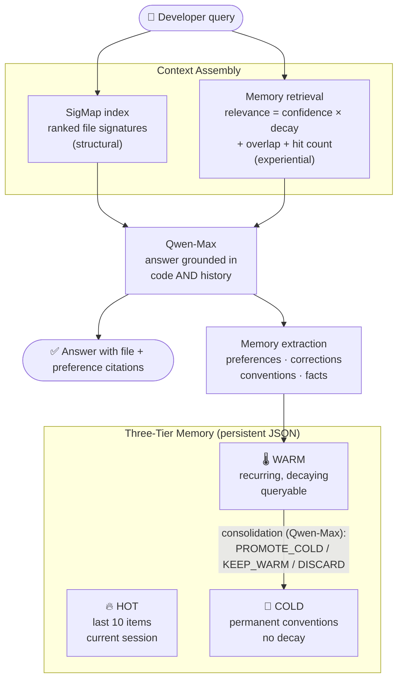

# CodeMind 🧠

**The developer AI that never forgets your codebase — structural code intelligence fused with persistent experiential memory.**

[](LICENSE)
[](tsconfig.json)
[](https://www.alibabacloud.com/en/solutions/generative-ai/qwen)
[](#)

Every AI coding assistant starts fresh. Every session you re-explain your project, your naming conventions, your preferences. *"We use snake_case." "Auth lives in src/auth." "Never use print — use logger."* Repeated. Every. Session.

CodeMind fixes this by combining two complementary memories:

- **Structural memory** (SigMap-style index) — *"here are the relevant files and signatures for your query"*
- **Experiential memory** (three-tier, persistent) — *"last time, you preferred the JWT approach over sessions"*

Neither alone is enough. Together they answer like a senior developer who has actually worked on your project.

---

## Table of Contents

- [Architecture](#architecture)
- [The Three Memory Tiers](#the-three-memory-tiers)
- [Memory Lifecycle](#memory-lifecycle)
- [How a Query Flows](#how-a-query-flows)
- [Quick Start](#quick-start)
- [Configuration](#configuration)
- [Project Structure](#project-structure)
- [Honest Status](#honest-status)
- [License](#license)

---

## Architecture



## The Three Memory Tiers

| Tier | Holds | Retention |
|---|---|---|
| **HOT** | Last 10 interactions of the current session | Rolling window |
| **WARM** | Recurring preferences and observations | Time-decayed confidence; periodically consolidated |
| **COLD** | Confirmed conventions and never-forget rules | Permanent — confidence 0.95, zero decay |

Each entry carries a category (`preference` · `correction` · `convention` · `fact`), a confidence score, a decay rate, a timestamp, and a hit counter.

## Memory Lifecycle

1. **Write (automatic)** — after every answer, Qwen-Max extracts memory-worthy items from the exchange and stores them in WARM.
2. **Read (every query)** — memories are ranked by `confidence × time-decay (60%) + query overlap (30%) + hit count (10%)`; the top matches join the prompt.
3. **Consolidate** — Qwen-Max reviews WARM entries and rules each one: promote to COLD (proved recurrent), keep in WARM (with a confidence bump), or discard (outdated). Explicit corrections beat old memories.

The intended trajectory: Session 1 answers like any assistant; by Session 10 it knows your conventions and cites your own files and past choices back to you.

## How a Query Flows

```
Session 1:  "How should I handle errors in this service?"
            → generic best-practice answer, memories extracted

Session N:  "How should I handle errors in this service?"
            → "You've been using GlobalExceptionHandler.java; your team
               convention is ErrorResponse objects with HTTP status codes —
               follow the pattern in PaymentService.handleException()."
```

## Quick Start

**Prerequisites:** Node.js 18+, a [Qwen Cloud API key](https://www.alibabacloud.com/en/product/modelstudio).

```bash
git clone https://github.com/manojmallick/codemind.git
cd codemind
npm install

cp .env.example .env        # add your QWEN_API_KEY

npm run dev                 # multi-session demo on a sample repo index
```

## Configuration

| Variable | Default | Purpose |
|---|---|---|
| `QWEN_API_KEY` | — (required) | Qwen Cloud API key |
| `QWEN_BASE_URL` | `https://dashscope.aliyuncs.com/compatible-mode/v1` | OpenAI-compatible endpoint |

Memory persists to `codemind_memory.json` (constructor parameter).

## Project Structure

```
codemind/
├── src/
│   ├── index.ts        # CodeMind class — context assembly, chat, extraction
│   ├── memory.ts       # three-tier memory, relevance scoring, SigMap store, consolidation
│   └── qwenClient.ts   # Qwen Cloud client with robust JSON handling
└── README.md
```

## Honest Status

This is a working prototype built for the hackathon window. The SigMap store here is a lightweight lexical simulator of the full [SigMap](https://www.npmjs.com/package/sigmap) signature index; the demo transcript is generated live per run, and no cross-session accuracy numbers are claimed until measured. See the memory-relevance formula in [src/memory.ts](src/memory.ts) — it is deliberately simple and inspectable.

## License

[MIT](LICENSE) © 2026 Manoj Mallick · Built for the Qwen Cloud Hackathon, Track 1 (MemoryAgent).
